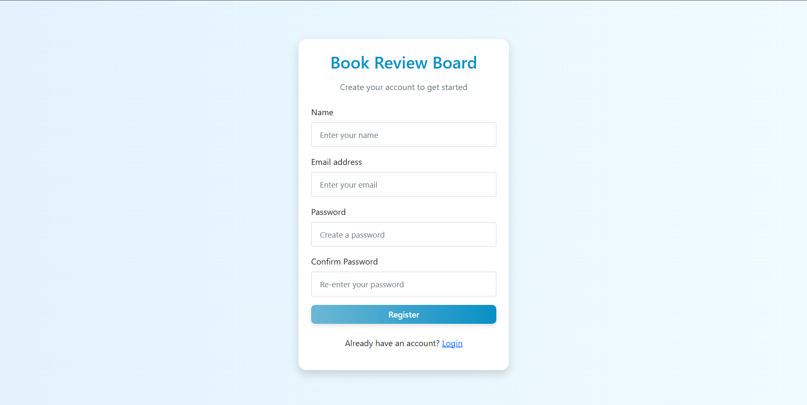

---

# Frontend – `README.md`

# Book Review Board - Frontend

This is the **frontend** for the Book Review Board web application.  
It is built with **React (Vite)**, **Redux Toolkit**, and **React Router DOM**.  
The frontend communicates with the backend API to allow users to register, login, add books, browse books, view book details, and write reviews.

---

##  Tech Stack
- **React (Vite)** – Fast React setup
- **Redux Toolkit** – State management
- **React Router DOM** – Routing
- **Bootstrap 5 + React-Bootstrap** – UI styling
- **React Hot Toast** – Notifications
- **Axios** – API calls

---

##  API Base URL

- **Local Development** → `http://localhost:3214/api`  
- **Production (Render)** → `https://backend-kvaf.onrender.com/api`

---

frontend/
├── src/
│   ├── app/            # redux store configuration
│   ├── components/     # Shared UI components
│   ├── context/        # AuthContext
│   ├── features/       # Redux slices & thunks
│   ├── pages/          # Pages (Books, BookDetails, Auth, AddBook)
│   ├── services/       # API services
│   └── App.jsx         # App entry
├── public/
└── package.json


## Setup Instructions

1. Clone the repo and move into the folder  
2. Install dependencies  
3. Start the frontend  

```cmd
git clone https://github.com/arunk-k/frontend.git
cd frontend
npm install
npm run dev
```
## Screenshots

### Books Page


### Logged In Books Page


### Login Page


### Register Page


### Book Details Page


### Add Book Page


